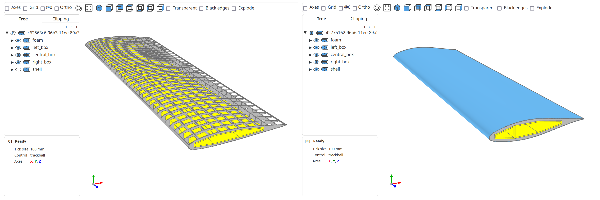

# CQ-UAV

Generative UAV models with CadQuery and SplineCloud





# Installation

```
pip install git+https://github.com/nomad-vagabond/cq-uav.git@<version_tag>
```
Replace `<version_tag>` with the recent tag


# Wing Model


## Airfoil data

Airfoil geometry and aerodynamic coefficients are collected from the open [SplineCloud](https://splinecloud.com/explore/) repositories.

The airfoil collection can be loaded this way:

```python

from cquav.wing.airfoil import load_airfoils_collection

airfoils_collection = load_airfoils_collection()
airfoil_data = airfoils_collection["NACA 6 series airfoils"]["NACA 64(3)-218 (naca643218-il)"]
```

## Retangular Wing Console

The wing model with a constant chord.

### Geometry

Airfoil shapes are approximated with smoothing B-Splines, while sharp tails are thickened to avoid malformed geometry.

Wing console consists of three parts:

- three-chamber box compartment (made of construction material, such as carbon or fiberglass);
- shaper (XPS foam, PLA, or other lightweight material);
- shell (coating layer: fiberglass or other).

Geometry is generated based on the airfoil type and wing size.
Currently, box thickness is selected automatically based on the profile height.

### Instantiating model

```python
from cquav.wing.airfoil import Airfoil
from cquav.wing.profile import AirfoilSection
from cquav.wing.rect_console import RectangularWingConsole

airfoil = Airfoil(airfoil_data)
airfoil_section = AirfoilSection(airfoil, chord=200)
wing_console = RectangularWingConsole(airfoil_section, length=800)
```

Displaying wing model in Jupyter Notebook (requires [jupyter-cadquery](https://github.com/bernhard-42/jupyter-cadquery) ):

```python
import cadquery as cq
from jupyter_cadquery import show

assy = cq.Assembly()
assy.add(wing_console.foam, name="foam", color=cq.Color("lightgray"))
assy.add(wing_console.front_box, name="left_box", color=cq.Color("yellow"))
assy.add(wing_console.central_box, name="central_box", color=cq.Color("yellow"))
assy.add(wing_console.rear_box, name="right_box", color=cq.Color("yellow"))
assy.add(wing_console.shell, name="shell", color=cq.Color("lightskyblue2"))
show(assy, angular_tolerance=0.1)
```

### Assigning materials, calculating and displaying wing console properties

```python
from cquav.materials import IsotropicMaterial, FluidProperties

air_density = 1.225 # [kg/m^3]
velocity = 35 # [m/s]
kinematic_viscosity = 1.460*1e-5 ## [m^2/s]

air_props = FluidProperties(air_density, velocity, kinematic_viscosity)
alpha = 5 # [degrees] - angle of attack

XPS_foam = IsotropicMaterial(30, 1e3, 25*1e6) # (density, tensile strength, tensile modulus)
Fiberglass_laminate = IsotropicMaterial(1800, 290*1e6, 12.4*1e9) # I know it is not isotropic - just another assumption )
materials = {"box": Fiberglass_laminate, "shell": Fiberglass_laminate, "foam": XPS_foam}

wing_console.assign_materials(materials)
wing_console.stats(alpha, air_props)
```

```
============================
Length: 1457.6691355004075, [mm]
Chord: 150, [mm]
Aspect ratio: 9.717794236669384
Area: 0.2186503703250611, [m^2]
----------
Mass: 1.5465428361878988, [kg] (box: 0.9566951728265329, foam: 0.027119495312970882, shell: 0.562728168048395)
Angle of attack: 0.3604633440024395, [degrees]
Excess lift force: 32.73014596820137, [N]
Console bend force: 35.77102468212604, [N]
Drag force: 1.3201885631129033, [N]
Lift to weight ratio: 2.7983907782328705
Center of aerodynamic pressure (lift): (37.5, 728.8345677502037), [mm, mm]
----------
Reinforcement box thickness: 1.427, [mm]
Shell thickness: 1, [mm]
Bend stress: 26.0240758429659, [MPa]
Shear stress: 0.6649548985267989, [MPa]
Von Mises stress: 26.049549296133048, [MPa]
Safety factor: 11.132630231074645
===========================
```

### Building wing model with lattice shaper body

```python
wing_console = RectangularWingConsole(airfoil_section, length=800, make_lattice=True)
```

### Solving for wing properties

Finding wing span with the desired relative tip deflection (takes much time for lattice shaper)

```python
solved_console_length = wing_console.fit_length_to_required_tip_deflection(
    alpha, air_props, tip_delta_max=0.1
)
```

Finding wing span with the desired relative tip deflection and desired excess lift force (unstable, work in progress)

```python
lift_force = 100 # [N]

solved_console_chord = wing_console.fit_chord_to_required_lift_force(
    alpha, air_props, lift_force, tip_delta_max=0.1
)
```

### Other Examples

More detailed examples are covered in the Jupyter notebooks in the 'examples' directory.

### Assumptions
- considered uniform distribution of pressure along the wing span (which is not true in reality);
- UAV pitch angle = 0, meaning horizontal flight mode with arbitrary angle of attack;
- only the wing box accepts aerodynamic load, which is applied along its central line;
- pure box bending is considered to calculate tip deflection;
- wing console is fixed on one of its ends, another end is free;
- no torque is analyzed;
- wing materials are considered to be isotropic;
